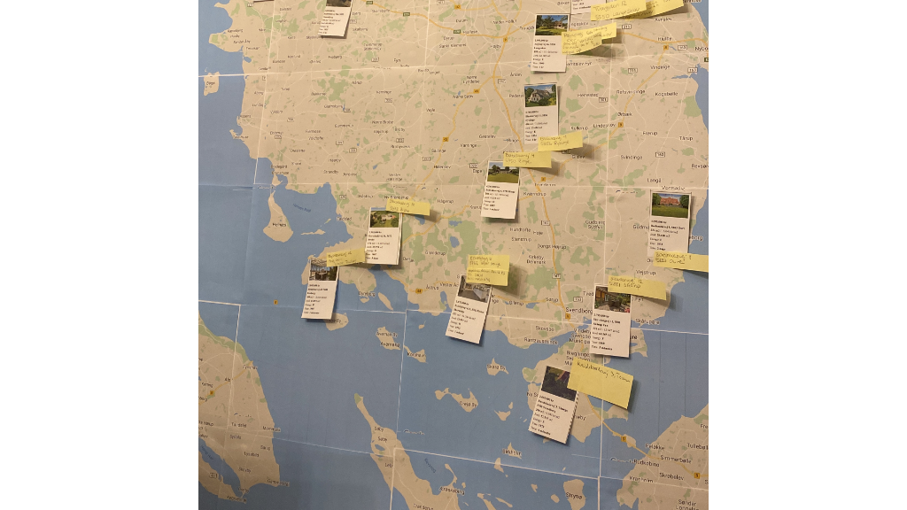
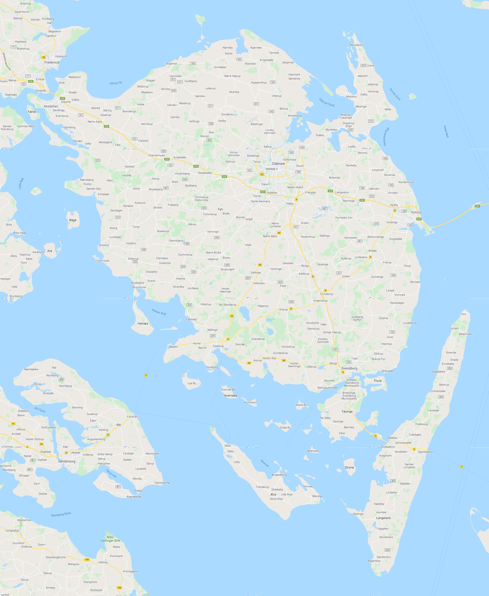

# Scripts for house hunting
:hide-uri-scheme: 

Just some scripts I'm making to help (and have more fun) with house hunting.



All of this is built with Java using https://jbang.dev - install jbang to run them.

== Map Generator

link:mapgenerator.java[] -  generates a wallpaper sized image to print a phyiscal map to put on a wall to place pins and images on.

Just need to specify a coordinate for a rectangle using upper left latitude and longitude and lower right latitude and longitude.

Requirements: Needs a google api key that has google static image api enabled.

Example:

[source,bash]
----
 ./mapgenerator.java --zoom=11 --coordinates=55.68,9.60,54.70,11.01 --api-key=YOUR_API_KEY
----

Example output (click to see full resolution): 

link:images/example-mapgenerator.png[]

== House Cards

For the wallmap and my own spreadsheets I wanted to grab latest info about a certain set of houses. For that I made a script that grabs data from https://boliga.dk a danish house market aggregator.

It uses playwright to navigate the site and scrape the data and then generates a csv file.

Input is a list of addresses.

Example: 

[source,shell]
----
jbang housecard.java --headless "Randersvej 45, 8800 Viborg" "Bruunshåbvej 6, 8800 Viborg"
----

This will generate `houses.csv` with info like:

```
rooms,address,timeOnMarket,lotSize,payout,boligaUlr,yearBuilt,ownerExpense,createdDate,agencyUrl,price,imageUrl,pricepersqm,houseSize,energy
5,"Randersvej 45,  8800 Viborg",1 måned ,786,75.000,https://www.boliga.dk/bolig/1800243/randersvej_45_8800_viborg,1935,2.203,29. jun. 2021,https://www.edc.dk/alle-boliger/viborg/8800/randersvej-45/?sagsnr=88103669,1.495.000,https://i.boliga.org/dk/max/1347/1347739.jpg,9.228,162,E
5,"Bruunshåbvej 6,  8800 Viborg",1 år ,911,90.000,https://www.boliga.dk/bolig/1674188/bruunshaabvej_6_8800_viborg,1969,2.366,19. jun. 2020,https://www.brikk.dk/ejendom/bruunshaabvej-6-8800-viborg/,1.735.000,https://i.boliga.org/dk/max/1387/1387936.jpg,12.218,142,D
```	
`

== Make cards 

link:boliga/makecards.java[] can take the csv produced above, run it through a template (`house.adoc.qute`) and generate a file you can do use.

Default it generates a 4 column grid with info to make cards to put on your wallmap as shown at top of this page.


